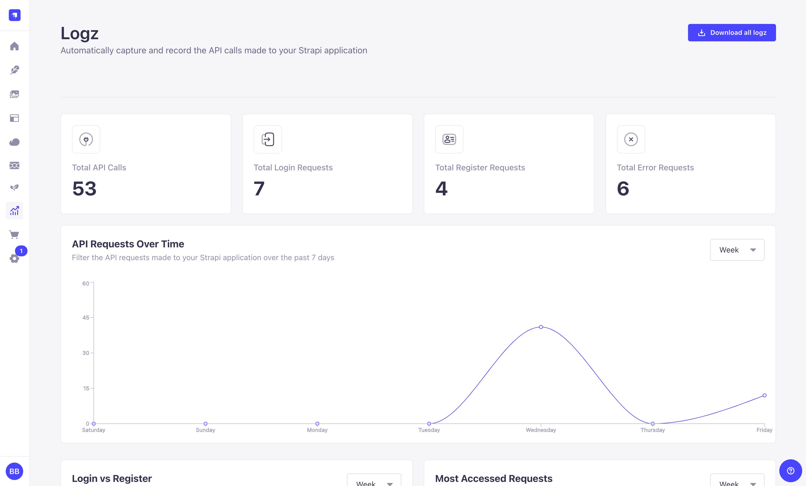
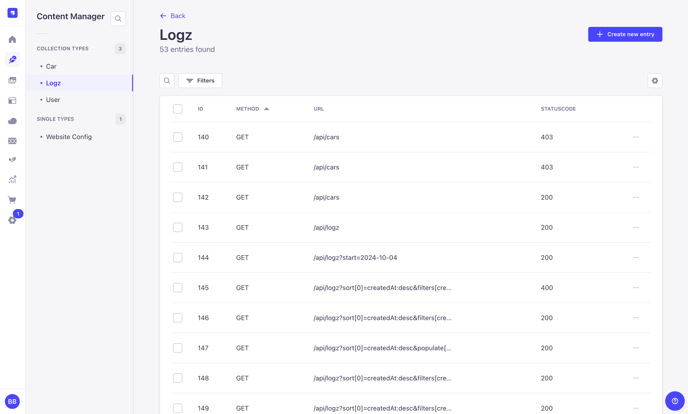

# Strapi Plugin Logz

Automatically capture and record the API calls made to your Strapi application



- [Strapi Plugin Logz](#strapi-plugin-logz)
  - [💸 Support Me](#-support-me)
  - [⚙️ Version](#️-version)
  - [💻 Prerequisites](#-prerequisites)
  - [⬇️ Installation](#️-installation)
  - [🎚️ Plugin Configuration](#️-plugin-configuration)
  - [▶️ Usage](#️-usage)
  - [📝 License](#-license)
  - [🚀 Services](#-services)
    - [Find](#find)
    - [FindOne](#findone)
    - [Count](#count)

## 💸 Support Me

If you can 😊

<a href="https://buymeacoffee.com/llehXIrI8g" target="_blank"></a>

## ⚙️ Version

This plugin is compatible with Strapi v5.

## 💻 Prerequisites

- Node v18+ (I recommend using [nvm](https://github.com/nvm-sh/nvm), there is a windows and mac/linux version)
- A Strapi v5 project (`npx create-strapi-app@latest my-project`)

## ⬇️ Installation

Install the plugin by running the following command:

```bash
npm install strapi-plugin-logz
```

## 🎚️ Plugin Configuration

The plugin configuration accepts a single `skipList` property.

This is the type definition for the configuration:

````ts
/**
 * Configuration for the Logz Strapi plugin
 */
export interface LogzConfig {
  /**
   * Enter the list of collections to skip creating logs for
   *
   * @default []
   *
   * @example
   * ```ts
   * // config/plugins.ts
   *export default ({ env }) => ({
   *  // ...
   *  logz: {
   *    enabled: true,
   *    config: {
   *      // This will skip creating logs for the collection "car"
   *      // All requests sent to /api/cars will not be logged
   *      skipList: ["car"],
   *    },
   *  },
   *  // ...
   *});
   */
  skipList: Array<string>;
}
````

## ▶️ Usage

After installing, you can access the Logz Dashboard by navigating to the `Logz` section in the admin panel.




## 📝 License

This project is licensed under the MIT License - see the [LICENSE](LICENSE.md) file for details

## 🚀 Services

### Find

```ts
await strapi.plugin("logz").service("logz").find(QUERY_PARAMS_OBJECT);
```

### FindOne

```ts
await strapi.plugin("logz").service("logz").findOne(ID, QUERY_PARAMS_OBJECT);
```

### Count

```ts
await strapi.plugin("logz").service("logz").count(QUERY_PARAMS_OBJECT);
```
